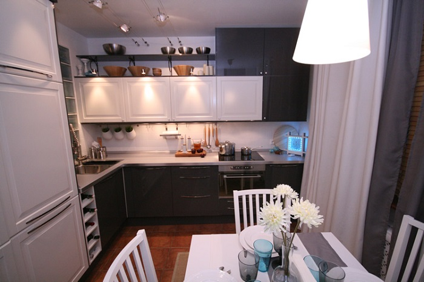
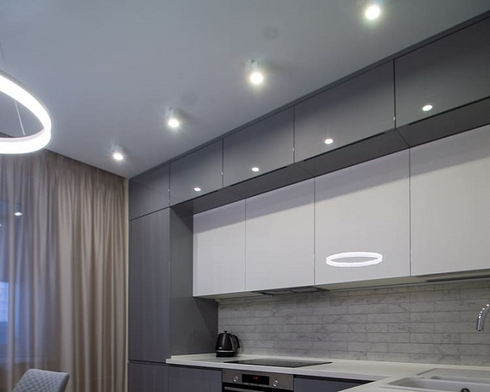
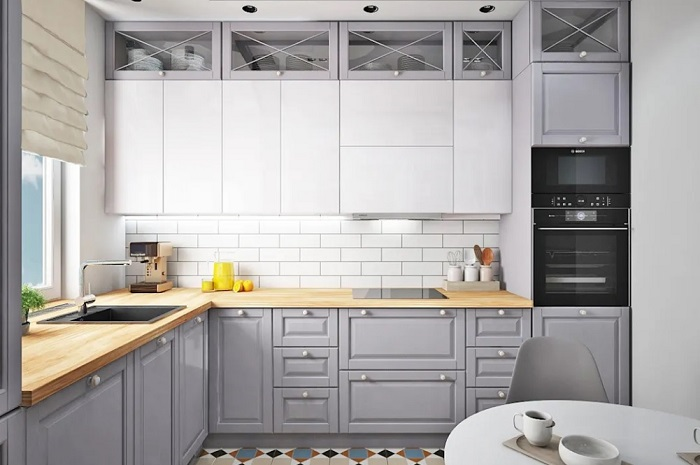
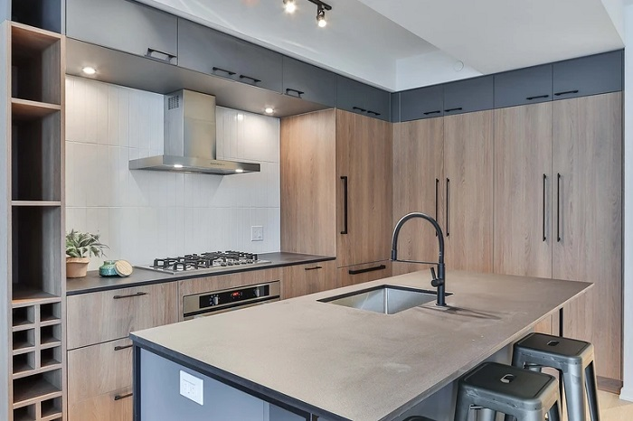

# 4 beautiful and functional ideas for the design of the mezzanine kitchen set

Mezzanine kitchen sets have many advantages.  Let's take a closer look at the design options for such mezzanine cabinets.

- Idea 1: Cabinets with increased depth

The depth of the mezzanine cabinets can be based on either the bottom hinged row or the width of the countertop. In the first case, it will be about 40 cm, in the second - from 60 cm. In a deeper mezzanine, respectively, can fit a lot more things. In addition, such a kitchen set will look more interesting than the standard one - an additional volume under the ceiling will attract attention. However, if you plan deep cabinets, be sure to think about the location of ceiling fixtures. So, for example, built-in spotlights should not overlap the garnish, and hinged - prevent the comfortable opening of the cabinet doors.

- Idea 2: Cabinets with glass inserts

In photos that are published in interior blogs, you can often see upper cabinets with blank fronts that match the shade of the ceiling or walls. However, even the overall color scheme does not always allow you to get rid of the feeling that the top row of cabinets "overhangs" and "presses". In this case, glass inserts come to the rescue, which are perfect for kitchens in the aesthetics of Provence, Classics or Scandi. Particularly close attention to this method should be paid to owners of cramped kitchens, as such inserts will make the set lighter, airy and even slightly increase the space. 

- Idea 3: Upper cabinets as an independent element

In some interiors, owners prefer to abandon the bottom row of hinged cabinets in favor of a horizontal upper module above the stove. In this case, the mezzanine also serves as a disguise for the hood. Please note that this solution requires the provision of full-fledged cabinets from floor to ceiling, which will house all the necessary kitchen utensils. You can't just use the top row of cabinets - they won't be enough for your purposes.

- Idea 4: Cabinets with fronts in the color of the walls

We have already mentioned this technique, now we propose to consider it in more detail. If you pick the mezzanine cabinets to match the color of the walls, they can visually dissolve in the interior and not attract unnecessary attention to themselves. This method is worth adopting for owners of studio apartments, in which the main emphasis should be aimed at the recreation zone, and not cooking. Also the idea comes in handy for tiny kitchens, where you do not want to crush the space with shapes and colors. If you're afraid that the final set will look dull and boring, make an accent on the apron - if it's a contrast, all the attention will focus on it.

